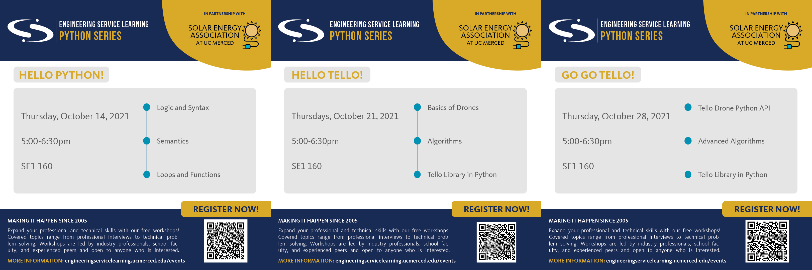

## 2021 Fall SEA x ENGRSL Python Workshop Series

This repository contains all materials related to the Python workshop series hosted by the **Solar Energy Association (SEA)** and **Engineering Service Learning (ENGRSL)** at the University of California, Merced, in the fall semester of 2021.

These workshops aim to teach the fundamentals of computer programming to participants by using Python as a first language. Workshop participants will work in groups to solve logical puzzles, design algorithms, write code, and finally apply their knowledge to program Tello quadcopter drones.

## Workshop Schedule

The following flyers were created by **Engineering Service Learning (ENGRSL).** All times are in Pacific Time. All rooms are locate on-campus at the University of California, Merced.

## Quick Links

Click on any of these links to view the handout page for each particular event!
- [Workshop 1: Hello Python!](./Workshop_1/README.md)
- [Workshop 2: Hello Tello!](./Workshop_2/README.md)
- [Workshop 3: Go Go Tello!](./Workshop_3/README.md)
